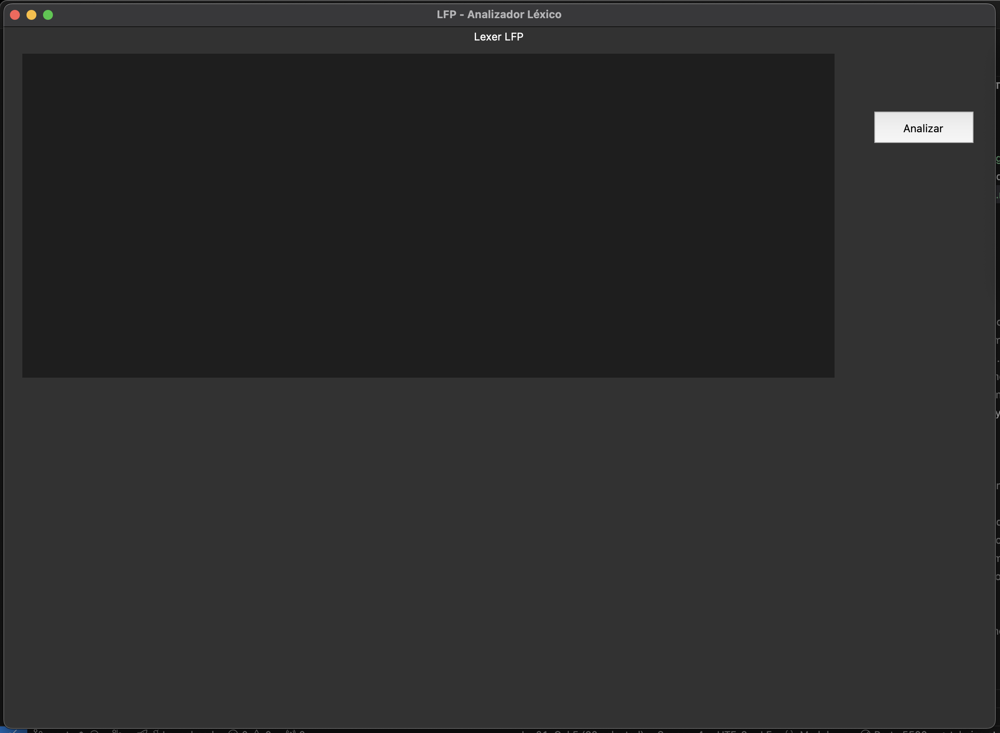
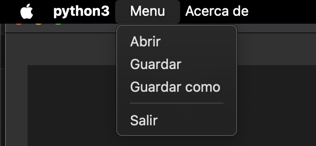
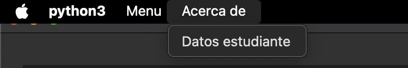
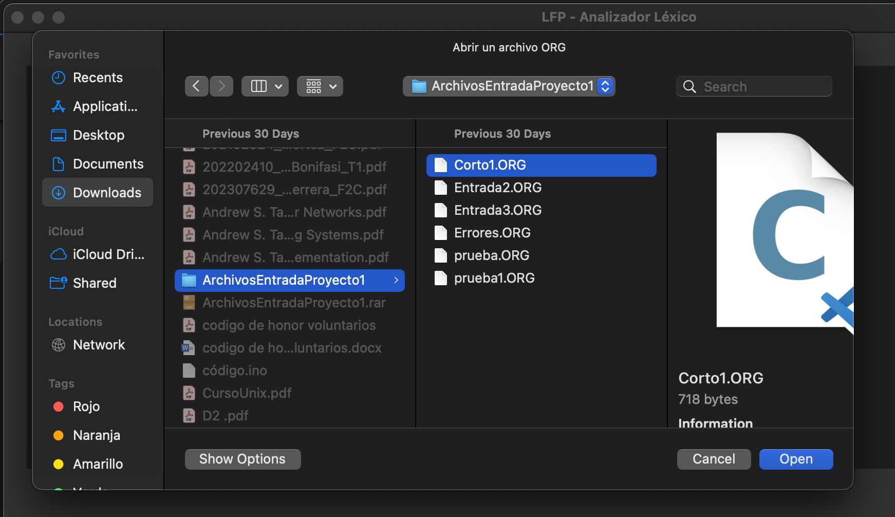
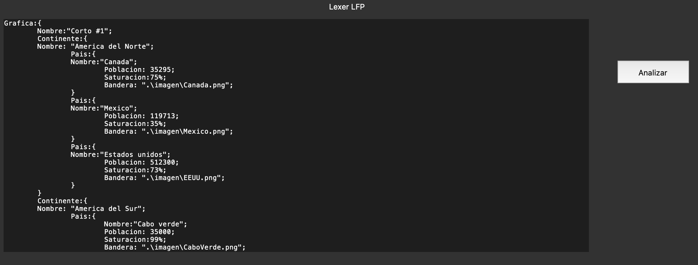
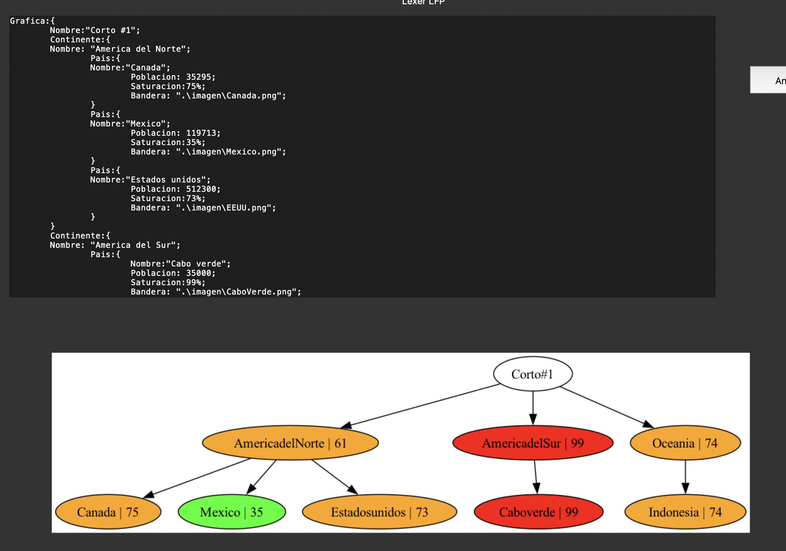
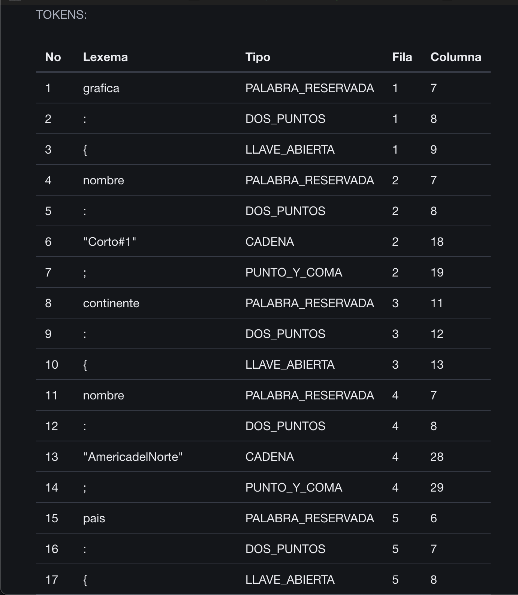
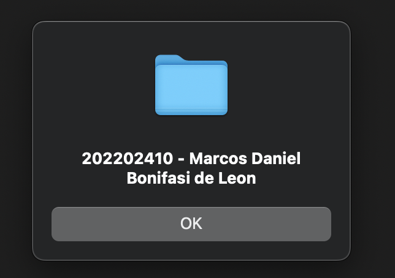

# Manual de Usuario

## Tabla de contenidos

- [Ejecutar App](#ejecutar-app)
- [Menu](#menu)
    - [Abrir archivo](#abrir-archivo)
    - [Datos estudiante](#datos-estudiante)
- [Finalizar App](#finalizar-app)

---------

## Ejecutar App

Primero nos aseguramos de estar en la ubicación raiz de nuestra aplicación.

Luego, se debe compilar el analizador por medio de la terminal con el siguiente comando.

```bash
    gfortran ./Proyecto1/modules/AppModule.f90 ./Proyecto1/modules/ErrorModule.f90 ./Proyecto1/utils/HelperModule.f90 ./Proyecto1/utils/LexerModule.f90 ./Proyecto1/modules/TokenModule.f90 ./Proyecto1/main.f90 -o ./Proyecto1/built/main
```

Esto generará nuestro archivo ejecutable, para luego ser utilizado por la aplicación de escritorio.

Luego procedemos a ejecutar la aplicación de escritorio por me dio de la terminal con el siguiente comando.


```bash
    python3 ./Proyecto1/GUI/index.py
```

Te deberia abrir el una ventana emergente mostrando lo siguiente.



---------

## Menu

En la parte superior izquierda podemos poder las opciones de nuestro menu.
- Menu
    - Abrir
    - Guardar
    - Guardar como
    - Salir




- Acerca de
    - Datos estudiante




---------

### Abrir archivo
Si damos click en `abrir` saldra el explorador de archivos donde podremos buscar el archivo (ORG) para importar su contenido.



En este caso elegimos un archivo y damos click en `open`.
Lo cual nos importara el contenido de ese archivo a nuestro editor de texto.



Luego damos click en el buton`Analizar`.
Si el text no contiene ningun error lexicografico nos mostrara el grafo del AFD, asi como tambien generara un sitio web con el detalle de todos los tokens.



---------

### Datos estudiante
Para mostrar los datos del estudiante damos clic en `Acerca de > Datos estudiante` en el menu.



---------

## Finalizar App

Para finalizar la aplicación basta con dar clic en el boton `x` en la esquina superior derecha.
