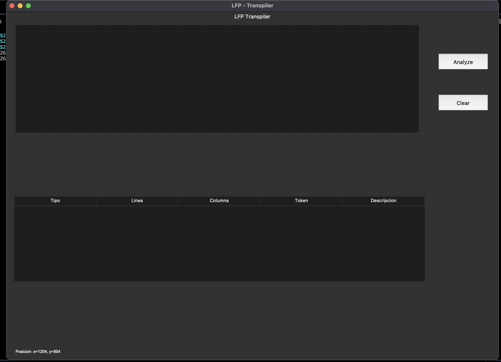

# Compilador para Diseño de Páginas Web en Fortran

**Autor:** Marcos Daniel Bonifasi de Leon
**Fecha:** Octubre 2024  
**Facultad de Ingeniería**  
**Universidad de San Carlos de Guatemala**  




## Tabla de Contenidos
1. [Introducción](#introducción)
2. [Instalación y Requisitos del Sistema](#instalación-y-requisitos-del-sistema)
3. [Uso del Compilador](#uso-del-compilador)
4. [Análisis Léxico y Sintáctico](#análisis-léxico-y-sintáctico)
5. [Generación de Archivos HTML y CSS](#generación-de-archivos-html-y-css)
6. [Solución de Problemas](#solución-de-problemas)
7. [Glosario de Términos](#glosario-de-términos)
8. [Referencias](#referencias)

## Introducción
Este manual tiene como objetivo guiar al usuario en el uso del compilador desarrollado en Fortran para el diseño de páginas web. El compilador realiza el análisis léxico y sintáctico de archivos de entrada que contienen definiciones de controles y sus propiedades, y genera código HTML y CSS para construir las páginas web.

Este proyecto es parte del curso de Lenguajes Formales y de Programación de la Universidad de San Carlos de Guatemala. El compilador utiliza un autómata finito determinista (AFD) para el análisis léxico, y una gramática libre de contexto para el análisis sintáctico.

### Descripción General
El compilador permite a los usuarios diseñar páginas web usando un lenguaje simple que define la posición, el tamaño, y otras propiedades visuales de los elementos HTML como contenedores, botones, y etiquetas. Los archivos generados incluyen tanto la estructura de la página (`HTML`) como su formato visual (`CSS`).

### Objetivos del Manual
Este manual tiene como objetivo:
- Instruir al usuario sobre cómo instalar y utilizar el compilador.
- Proporcionar ejemplos claros de archivos de entrada y su traducción a HTML/CSS.
- Explicar el proceso de análisis léxico y sintáctico.
- Describir cómo interpretar y solucionar errores comunes.

## Instalación y Requisitos del Sistema

### Requisitos del Sistema
Para ejecutar el compilador, se necesita lo siguiente:
- Sistema operativo con soporte para Fortran y Python.
- Compilador Fortran, como `gfortran`.
- Python 3.6+ con las librerías `Tkinter`

### Proceso de Instalación
Siga estos pasos para instalar el compilador:
1. Descargue el código fuente desde el repositorio de GitHub proporcionado.
2. Instale el compilador `gfortran`.
3. Instale las dependencias de Python utilizando el comando:
   ```bash
   pip install tk 
   ```
4. Compile el código fuente en Fortran ejecutando el siguiente comando:
   ```bash
   gfortran lexer.f95 parser.f95 -o compilador_web
   ```
5. Ejecute el compilador con el siguiente comando:
   ```bash
   ./compilador_web
   ```

## Uso del Compilador
El compilador incluye una interfaz gráfica desarrollada en Python (Tkinter) que permite cargar, modificar y analizar archivos de código fuente. A continuación, se explican los principales componentes de la interfaz y su funcionamiento.

### Interfaz Gráfica
La interfaz incluye un área de edición de texto donde el usuario puede escribir o cargar un archivo de código fuente que contiene definiciones de controles y propiedades para una página web. También incluye un botón para ejecutar el análisis léxico y sintáctico, mostrando los resultados o errores en una consola integrada.

### Carga de Archivos de Código Fuente
El compilador acepta archivos de texto con extensiones `.txt` que contienen la definición de los elementos que formarán parte de la página web. El archivo debe seguir una sintaxis predefinida para que el compilador pueda procesarlo correctamente.

#### Ejemplo de archivo de entrada
A continuación, se presenta un ejemplo de archivo de entrada que define una página web con varios controles:
```plaintext
// Contenedores y propiedades
Contenedor contlogin;
contlogin.setAncho(190);
contlogin.setAlto(150);
contlogin.setColorFondo(47,79,79);

Contenedor contFondo;
contFondo.setAncho(800);
contFondo.setAlto(100);
contFondo.setColorFondo(64,64,64);
```

## Análisis Léxico y Sintáctico

### Análisis Léxico
El análisis léxico es la primera fase de la compilación, en la que se divide el archivo de entrada en tokens. El compilador utiliza un autómata finito determinista (AFD) para este proceso. Los tokens generados incluyen palabras clave, identificadores, números y símbolos.

| **Token**       | **Descripción**                             | **Ejemplo**   |
|-----------------|--------------------------------------------|---------------|
| Palabra clave    | Definición de un contenedor                | `Contenedor`  |
| Identificador    | Nombre del control                          | `contlogin`   |
| Número           | Valor numérico                             | `190`         |
| Símbolo         | Delimitador de propiedades                  | `;`           |

### AFD Utilizado
El autómata finito determinista (AFD) utilizado en el análisis léxico consta de varios estados, cada uno de los cuales representa una posible transición según el carácter procesado. Un gráfico del AFD se muestra a continuación:

### Análisis Sintáctico
Una vez que el análisis léxico ha generado los tokens, el análisis sintáctico verifica que estos sigan las reglas de una gramática libre de contexto (GLC) predefinida. Esto garantiza que el archivo de entrada sea estructuralmente válido.

#### Gramática Libre de Contexto (GLC)
La gramática libre de contexto utilizada en el compilador es la siguiente:
```plaintext
<S> ::= <comando> | <comando> <S>
<comando> ::= <declaracion> <propiedades> ";"
<declaracion> ::= "Contenedor" <identificador>
<propiedades> ::= <propiedad> | <propiedad> <propiedades>
<propiedad> ::= <identificador> ".setAncho" "(" <numero> ")"
              | <identificador> ".setAlto" "(" <numero> ")"
              | <identificador> ".setColorFondo" "(" <numero>, <numero>, <numero> ")"
<identificador> ::= <letra> <identificador> | <letra>
<numero> ::= <digito> <numero> | <digito>
```

#### Parser Descendente Recursivo
El compilador utiliza un parser descendente recursivo para procesar la entrada conforme a la gramática definida. A continuación, se describe el funcionamiento del parser:
- El parser recibe una secuencia de tokens generada por el análisis léxico.
- Cada token se verifica contra las reglas de la gramática libre de contexto.
- Si los tokens no coinciden con ninguna regla, se genera un error de sintaxis.

### Errores Sintácticos Comunes
Durante el análisis sintáctico, es posible que se generen errores si la estructura del archivo de entrada no sigue las reglas de la gramática. Algunos ejemplos de errores son:
- **Error de token inesperado**: Se produce cuando un token aparece en un lugar no permitido.
- **Falta de símbolo de cierre**: Ocurre cuando falta un paréntesis o punto y coma en una declaración.

## Generación de Archivos HTML y CSS
El compilador genera archivos HTML y CSS una vez que el análisis léxico y sintáctico ha sido exitoso. Estos archivos corresponden a la estructura y estilo visual de la página web definida en el archivo de entrada.

### HTML Generado
El archivo HTML contiene la estructura básica de la página web. Un ejemplo de código HTML generado es el siguiente:
```html
<!DOCTYPE html>
<html lang="es">
<head>
    <meta charset="UTF-8">
    <meta name="viewport" content="width=device-width, initial-scale=1.0">
    <link rel="stylesheet" href="styles.css">
    <title>Mi Página Web</title>
</head>
<body>
    <div id="contlogin" style="position: absolute; width: 190px; height: 150px; background-color: rgb(47,79,79);">
        <label id="Nombre" style="position: absolute; top: 21px; left: 8px; width: 44px; height: 13px; color: rgb(128,128,128);">Nombre</label>
    </div>
</body>
</html>
```

### CSS Generado
El archivo CSS incluye las reglas de estilo que definen el formato visual de los elementos HTML. Un ejemplo de código CSS generado es el siguiente:
```css
#contlogin {
    position: absolute;
    top: 110px;
    left: 586px;
    width: 190px;
    height: 150px;
    background-color: rgb(47,79,79);
}

#Nombre {
    position: absolute;
    top: 21px;
    left: 8px;
    width: 44px;
    height: 13px;
    color: rgb(128,128,128);
    font-size: 12px;
}
```

